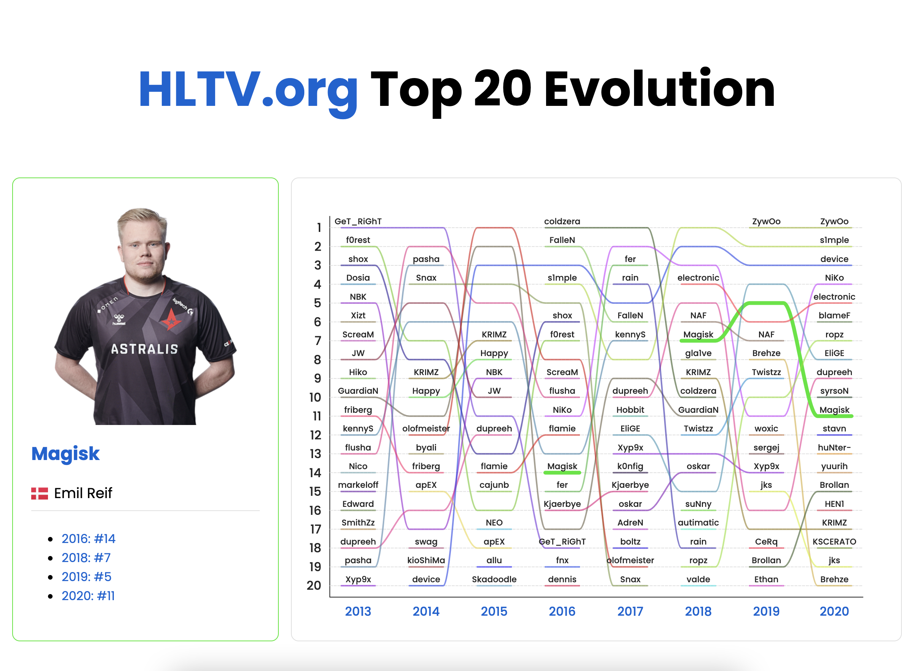

# [HLTV.org Top 20 Ranking evolution](https://hltv.vercel.app)

[https://hltv.vercel.app](https://hltv.vercel.app)

Evolution of HTLV.org CS:GO players ranking across time.



## Getting Started

First, run the development server:

```bash
yarn install
yarn dev
```

Open [http://localhost:3000](http://localhost:3000) with your browser to see the result.

## Updating with latest information

This [JSON file](./src/data/rankings.json) contains information about every ranking every year.

- Add a new entry to the `rankings` array
  - `article` is optional
- `cd scripts`
- `yarn install`
- `yarn generate`
- :tada:

### Overrides

Some players have duplicate names (such as `Nico`).

Using [hltv-overrides.json](./src/data/hltv-overrides.json) you can override
the HLTV API response for this specific ign (in-game-name)
